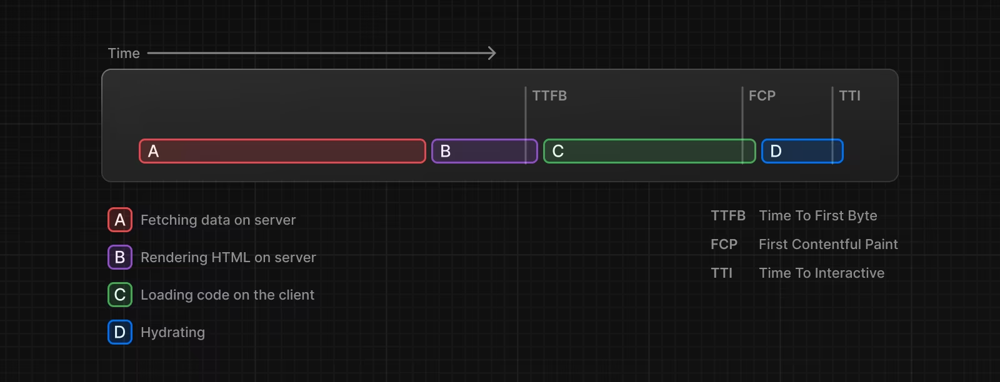
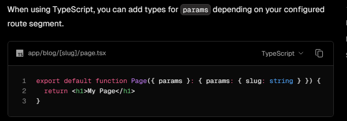
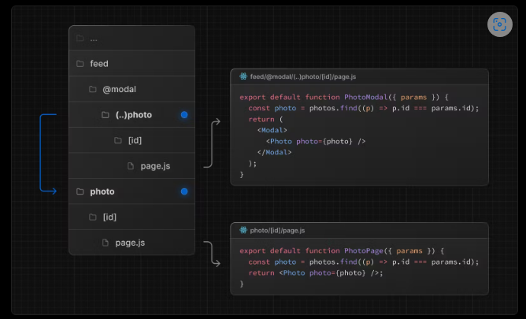

Domain: https://estudy.engineer/
## TAG
VIDEO : https://elearning.engineer/api/Video_API/Get_AllVideoOfLesson
FLASH_CARD : https://elearning.engineer/api/VocabFlashCard_API/Get_AllVocabOfLesson(complete)
Multiple_Choice ( trắc nghiệm cơ bản có 4 đáp án ) : https://elearning.engineer/api/Question_API/Get_AllQuestionOfLesson(complete)
DOUBLE_CHOICE ( trắc nghiệm chỉ có 2 câu a,b )  : https://elearning.engineer/api/Question_API/Get_AllQuestionDoulbeChoice
FIND_PAIR ( chọn 2 cặp ) : https://elearning.engineer/api/VocabFlashCard_API/Get_AllVocabFindpair(complete)(complete)
LISTEN_VOCAB ( bài nghe chọn từ vựng ): https://elearning.engineer/api/VocabFlashCard_API/Get_AllListenChossenVocab(complete)
LISTEN_PICTURE ( bài nghe tranh 4 options, 0 tittle ) : https://elearning.engineer/api/Question_API/Get_AllQuestionOfLesson
LISTEN_QUEST_RESPONSE ( bài nghe hỏi đáp 3 options, 0 tittle ) : https://elearning.engineer/api/Question_API/Get_AllListen_Quest_Res
LISTEN_SPEECH ( đối thoại và nghe hiểu bài nói 4 options, full tittle ): https://elearning.engineer/api/Question_API/Get_AllListenSpeech
FILL_WORD ( bài điền từ , gõ tay ):  https://elearning.engineer/api/VocabFlashCard_API/Get_AllVocabFillWorld
READING (bài điền từ = trắc nghiệm ): https://elearning.engineer/api/Question_API/Get_AllQuestionReading
WRITTEN_FORM ( form email có nhiều options ): 

This is a [Next.js](https://nextjs.org/) project bootstrapped with [`create-next-app`](https://github.com/vercel/next.js/tree/canary/packages/create-next-app).
## Point API
Don't fotgot Header key/value : ContentType : application/json
--------------Register------------
[HttpPost]
https://elearning.engineer/api/Auth_API/Register(complete)
[UserEmail,UserPassword] can use UserPhone
--------------Login------------
[HttpPost]
https://elearning.engineer/api/Auth_API/Login(complete)
[UserEmail,UserPassword] 
Don't forgot save UserId when got reponse data from login
--------------User Update Avatar------------
[HttpPost]
https://elearning.engineer/api/Auth_API/User_UpdateAvatar
[userId] 

    const response = await axios.post('http://localhost:8000/api/Auth_API/User_UpdateAvatar', formData, {
                headers: {
                    'Content-Type': 'multipart/form-data'
                }
            });
            
--------------User Active Code------------
[HttpPost]
https://elearning.engineer/api/Auth_API/ActiveCode
[userId,code]      
ActiveCode

--------------GetAllUsers------------
[HttpGet]
https://elearning.engineer/api/Auth_API/Get_AllUsers(complete)
--------------GetAllCourse------------
[HttpGet]
https://elearning.engineer/api/Courses_API/Get_AllCourses(complete)
--------------Order Course [BuyCourse]------------
[HttpPost]
https://elearning.engineer/api/Order_API/Buy_Course(complete)
--------------Get All Course By User------------ lấy tất cả khóa học người dùng A hiện có
[HttpPost]
https://elearning.engineer/api/UserCourses_API/Get_AllCoursesByUser(complete)
[userId]
--------------Get All Users Buy Course ------------ lấy tất cả người dùng mua khóa học đó
[HttpPost]
https://elearning.engineer/api/UserCourses_API/Get_DetailCourseAndUserBought(complete)
[courseId]
--------------Get All Courses then User Hadn't Register Before--------------------
[HttpPost]
https://elearning.engineer/api/Courses_API/Get_UnregisteredCourses(complete)
[userId]
--------------Get All OutstandingCourses then User Hadn't Register Before--------------------
[HttpPost]
https://elearning.engineer/api/Courses_API/Get_OutstandingCoursesUserNotBought(complete)
[userId,amountOutstanding] // truyen tham so so luong vao
--------------Buy_Success [Buy_Success]------------
--------------Get Momo QR ------------
[HttpPost]
https://elearning.engineer/api/Momo_Payment(complete)
{
  "subPartnerCode": "",
  "requestId": "",
  "amount": ,
  "orderId": "",
  "orderInfo": "",
  "redirectUrl": "",
  "ipnUrl": "",
  "requestType": "",
  "extraData": "",
  "lang": ""
}
## Draw Data Momo
{
  "subPartnerCode": "",
  "requestId": "2323332323331321321",
  "amount": 10000,
  "orderId": "MM15403232433536472575",
  "orderInfo": "YOMOST Sua Chua Uong Bac Ha&Viet Quat 170ml/1 Hop.",
  "redirectUrl": "https://facebook.com",
  "ipnUrl": "https://www.youtube.com",
  "requestType": "captureWallet",
  "extraData": "",
  "lang": "vi"
}
## Draw request tracking 
gui len luc duoc chuyen qua redirect (page success ) sau do nhan ve ma status backend tra ve neu true/false
[Post]
https://elearning.engineer/api/Momo_Payment/RequestTracking
[orderId] (string)
[requestId] (string )


## Luyen tap
--------------Get_AllUnitsByCourse [Lay cac Part1 2 3 4 theo course]------------
[HttpPost]
https://elearning.engineer/api/Unit_API/Get_AllUnitsByCourse(complete)
[courseId,userId] -> if user have not this course, will return 404 bad request

--------------Get_AllContainerAndLessonByUnit ( lay 20 container + 6 lesson trong moi container ) ------------
[HttpPost]
https://elearning.engineer/api/Container_API/Get_AllContainerAndLessonByUnit(complete)
[unitId]

--------------Get All List Vocab of Lesson (Lesson of Container,Container of unit, unit of course ) [Data trả về này dùng để show 55 list vocab và random trò chơi flash card]--
[HttpPost]
https://elearning.engineer/api/VocabFlashCard_API/Get_AllVocabOfLesson(complete)
[lessonId]

--------------Get_AllQuestionOfLesson ----------------------------------------------------------------
[HttpPost]
https://elearning.engineer/api/Question_API/Get_AllQuestionOfLesson(complete)
[lessonId]
400 -> lỗi do lesson || 500 -> server ->> 200 success

--------------Get All List Vocab Find pair------------------------------------------------------------
[HttpPost]
https://elearning.engineer/api/VocabFlashCard_API/Get_AllVocabFindpair(complete)
[lessonId]

--------------Get All List Vocab Listen Chossen ( 1 file nghe có 9 cái đáp án ) ------------------------------------------------------------
[HttpPost]
https://elearning.engineer/api/VocabFlashCard_API/Get_AllListenChossenVocab [Tag = LISTEN_VOCAB ] (complete)
[lessonId]

--------------Get All List Vocab Fill World  ------------------------------------------------------------
[HttpPost]
https://elearning.engineer/api/VocabFlashCard_API/Get_AllVocabFillWorld [Tag = FILL_WORD ] 
[lessonId]

--------------------------Get All Video -----------------------------------
[HttpPost]
https://elearning.engineer/api/Video_API/Get_AllVideoOfLesson [Tag = VIDEO ] 
[lessonId]

--------------------------Get Question Listen Picture -----------------------------------
[HttpPost]
https://elearning.engineer/api/Question_API/Get_AllQuestionOfLesson [Tag = LISTEN_PICTURE ] 
[lessonId]

--------------------------Get Question Listen Picture -----------------------------------
[HttpPost]
https://elearning.engineer/api/Question_API/Get_AllListen_Quest_Res [Tag = LISTEN_QUEST_RESPONSE ] 
[lessonId]

--------------------------Get Question Speech -----------------------------------
[HttpPost]
https://elearning.engineer/api/Question_API/Get_AllListenSpeech [Tag = LISTEN_SPEECH ] 
[lessonId]

--------------------------Get Question Double choice -----------------------------------
[HttpPost]
https://elearning.engineer/api/Question_API/Get_AllQuestionDoulbeChoice [Tag = DOUBLE_CHOICE ] 
[lessonId]

--------------------------Get Question Reading -----------------------------------
[HttpPost]
https://elearning.engineer/api/Question_API/Get_AllQuestionReading [Tag = READING ] 
[lessonId]

## Getting Started

First, run the development server:

```bash
npm run dev
# or
yarn dev
# or
pnpm dev
# or
bun dev
```

Open [http://localhost:3000](http://localhost:3000) with your browser to see the result.

You can start editing the page by modifying `app/page.tsx`. The page auto-updates as you edit the file.

This project uses [`next/font`](https://nextjs.org/docs/basic-features/font-optimization) to automatically optimize and load Inter, a custom Google Font.

## Learn More

To learn more about Next.js, take a look at the following resources:

- [Next.js Documentation](https://nextjs.org/docs) - learn about Next.js features and API.
- [Learn Next.js](https://nextjs.org/learn) - an interactive Next.js tutorial.

You can check out [the Next.js GitHub repository](https://github.com/vercel/next.js/) - your feedback and contributions are welcome!

## Deploy on Vercel

The easiest way to deploy your Next.js app is to use the [Vercel Platform](https://vercel.com/new?utm_medium=default-template&filter=next.js&utm_source=create-next-app&utm_campaign=create-next-app-readme) from the creators of Next.js.

Check out our [Next.js deployment documentation](https://nextjs.org/docs/deployment) for more details.

# NEXTJS
* https://nextjs.org/
# REACT
* https://vi.legacy.reactjs.org/
* https://react.dev/
# REACT HOOK FORM
* https://react-hook-form.com/
# TAILWINDCSS
* https://tailwindui.com/
# SHADCN UI COMPONENT LIBRARY
* https://ui.shadcn.com/
https://www.youtube.com/watch?v=jdLsQEZ_H4o&list=PL8HkCX2C5h0VGhZnfbwf2hq7yD7nXMbJJ&index=1
# ZOD
* https://zod.dev/
# Convert css -> Tailwind tool
* https://lembdadev.com/tools/tailwind/css-to-tailwind-converter

# Request Api by Axios

# Redux ToolKits-storage-state

https://www.youtube.com/watch?v=ucX2zXAZ1I0&t=1218s
https://www.youtube.com/watch?v=27hMNWcsa-Y
https://www.youtube.com/watch?v=ucdjfU_XKpw&list=PLFfVmM19UNqn1ZIWvxn1artfz-C6dgAFb


# Route Groups: Sử dụng khi bạn muốn tổ chức file mà không ảnh hưởng đến URL.

# Dynamic Routes: Sử dụng khi bạn cần route với tham số động.

# Parallel Routes: Sử dụng khi bạn cần tải nhiều phần giao diện cùng lúc.

# Intercepting Routes: Sử dụng khi bạn cần chặn và xử lý trước khi vào route chính.



# http://localhost:8000/api/Momo_Payment
[POST]

{
  "subPartnerCode": "", // luon de null
  "requestId": "232331321321", //là id riêng biệt mỗi lần request momo, random + ( id user + id course ), mỗi mã là riêng biệt
  "amount": 10000, // price course
  "orderId": "MM154043356472575", //là id riêng biệt mỗi lần request momo, là mã từ bảng order khi user order thành công, cái này t gửi về cho m sau Bước mua khóa học
  "orderInfo": "Mua khóa xxx"// Description tự tạo -> thanh toán khóa xx yy zz
  "redirectUrl": "https://www.youtube.com", // chuyen ve trang xyz sau khi thanh toan thanh cong ( BACKEND )
  "ipnUrl": "https://facebook.com", // chuyen ve trang xyz sau khi thanh toan thanh cong ( sau khi post ) ( FRONT END )
  "requestType": "captureWallet", // de mac dinh nhu the nay
  "extraData": "eyJ1c2VybmFtZSI6ICJtb21vIn0=", // để Rỗng : ""
  "lang": "vi" ->> để theo language cấu hình FE, nếu chưa làm thì để mặc định vi
}
"redirectUrl": 
"ipnUrl": 
=>> nên để trùng url của front end 
Mỗi lần thanh toán chỉ có 10p
SUCCESS 
resultCode":0," == 0 là true
payUrl
là 2 trường quan trọng. PayUrl là m nhận về xong chuyển giao diện người dùng mua đến đó. Thanh toán tại đây thành công mới về giao diện theo requestId

{"partnerCode":"MOMORPBF20220425","orderId":"MM1540433536472575","requestId":"23233232331321321","amount":10000,"responseTime":1717146397649,"message":"Thành công.","resultCode":0,"payUrl":"https://payment.momo.vn/v2/gateway/pay?t=TU9NT1JQQkYyMDIyMDQyNXxNTTE1NDA0MzM1MzY0NzI1NzU&s=8af600ac20edb24191ce20ac05bc86f3c68e128d48b29437f2a857d02c9e70d3"}


# Flow thanh toán
User nhấn đăng ký học ->FE gửi data Order(2) lên -> -> BE lưu Order và gửi về cho FE [status 200, messages, và orderID] -> FE gửi data Payment(3) lên theo format mới 
->> BE gửi yêu cầu lên momo tạo mã -> trả về Url(0) và status(1) cho FE nhận, sau đó FE chạy trang URL(0) 
__True : trả về giao diện xyz -> gửi Post lên http://localhost:8000/api/Order_API/Buy_Success (4)-> BE lưu Order 
__false nếu hủy hoặc sau 10p : thông báo thanh toán thất bại

(0) -- payUrl
(1) -- resultCode

Data Order (2)
[Post]
http://localhost:8000/api/Order_API/Buy_Course
    "UserId" : "8fbac872-697a-427d-a00b-985ebd669212",
    "CourseId": 1,
    "Address": " dsndnsadnsad",
    "TotalAmount" : 1.5,
    "PhoneNumber" : "12321321"

Data trả về Status(200)
{ status = 200, orderId: 1005, message = "Course purchased successfully." }
orderId kiểu int

Mẹo : User nhấn mua , FE gửi axios Order(2) , nếu backend lưu được sẽ trả về status 200, messages, và orderID -> FE nhận status 200, 
OrderId tại code FE, rồi gửi tiếp axios Payment(3) -> backend gửi yêu cầu mã từ momo


Data payment(3)
 format mới
     public string SubPartnerCode { get; set; } = string.Empty;
     public string RequestId { get; set; } = string.Empty;
     public long Amount { get; set; } 
     public string OrderId { get; set; }= string.Empty;
     public string OrderInfo { get; set; } = string.Empty;
     public string RedirectUrl { get; set; } = string.Empty;
     public string IpnUrl { get; set; } = string.Empty;
     public string RequestType { get; set; } = string.Empty;
     public string ExtraData { get; set; } = string.Empty;
     public string Lang { get; set; } = string.Empty;
DATA NHẬN
(0) và (1)

Data Buy_Success (4)
OrderId (int) 
Data return 
_succes :  return Json(new { status = 200,order = existingOrder, message = "Update Order State Successful" });
_error :   return BadRequest("You Had Bought Before");


# draw Data

{
  "subPartnerCode": "",
  "requestId": "23233323232e3331321321",
  "amount": 10000,
  "orderId": "MM15403232332433536472575",
  "orderInfo": "YOMOST Sua Chua Uong Bac Ha&Viet Quat 170ml/1 Hop.",
  "redirectUrl": "https://facebook.com/",
  "ipnUrl": "https://www.youtube.com/",
  "requestType": "captureWallet",
  "extraData": "",
  "lang": "vi"
}


Nhớ đổi request + redirectUrl + ipnUrl + orderId
Method : http://localhost:8000/api/Momo_Payment
[POST]
Flow : 


#  Tìm hiều về race condition của lỗi bất đồng bộ 

Race condition là một tình huống xảy ra trong lập trình đa luồng khi hai hoặc nhiều luồng cố gắng thực hiện các hoạt động trên cùng một tài nguyên cùng một lúc mà không có sự đồng bộ hóa đúng đắn. Kết quả của các hoạt động này có thể phụ thuộc vào thứ tự của các luồng và thời điểm mà chúng được thực hiện, điều này có thể dẫn đến hành vi không mong muốn hoặc không nhất quán.

Trong ngữ cảnh của ứng dụng web của bạn, race condition có thể xảy ra khi có nhiều yêu cầu mạng được gửi và xử lý bất đồng bộ, và không có cơ chế nào để đảm bảo rằng chúng được xử lý theo thứ tự mong muốn. Điều này có thể dẫn đến tình trạng như vấn đề bạn đang gặp, khi một yêu cầu được xử lý trước khi yêu cầu khác hoàn thành, gây ra sự không nhất quán trong dữ liệu hoặc hành vi của ứng dụng.

Để giải quyết race condition, bạn có thể cần sử dụng các kỹ thuật đồng bộ hóa như mutex, semaphore hoặc sử dụng các cơ chế xử lý bất đồng bộ như async/await, Promise để đảm bảo thứ tự thực thi mong muốn và tránh xung đột giữa các hoạt động.

# Tìm hểu về  Preflight Request

Quá trình Preflight Request
Preflight Request: Trình duyệt sẽ gửi một yêu cầu HTTP OPTIONS đến máy chủ để kiểm tra xem yêu cầu chính sẽ được cho phép hay không. Yêu cầu này bao gồm các thông tin về phương thức HTTP và các tiêu đề mà yêu cầu chính sẽ sử dụng.

Server Response: Máy chủ phản hồi lại với thông tin về những phương thức HTTP và tiêu đề mà nó cho phép. Nếu máy chủ cho phép yêu cầu với phương thức và tiêu đề được sử dụng, trình duyệt sẽ tiến hành gửi yêu cầu chính.

Actual Request: Sau khi nhận được phản hồi cho phép từ máy chủ, trình duyệt sẽ gửi yêu cầu chính với dữ liệu thực tế.

